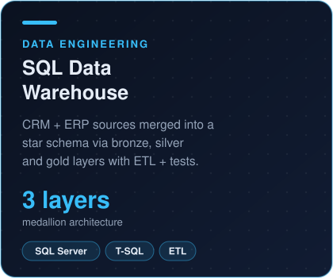
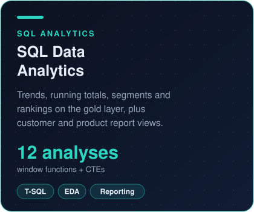
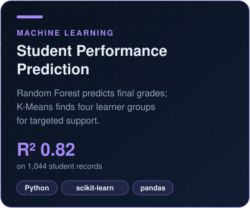

  

  
  

### About me

I turn messy business data into clean models, clear dashboards and decisions. My background in accounting and finance means I care about the numbers behind the numbers: reconciling sources, testing data quality, and explaining results to non-technical stakeholders.

- **Experience:** Data Analyst Intern at Covelopers (summer 2026)
- **Research:** MSc dissertation on sentiment in company earnings call transcripts using FinBERT
- **Looking for:** graduate Data Analyst and Analytics Engineer roles in London

### Featured projects

  
  
  

### Toolkit

| | |
|---|---|
| **Languages** |    |
| **Analysis & ML** |      |
| **BI & reporting** |   |
| **Data engineering** |     |
| **Tools** |    |
